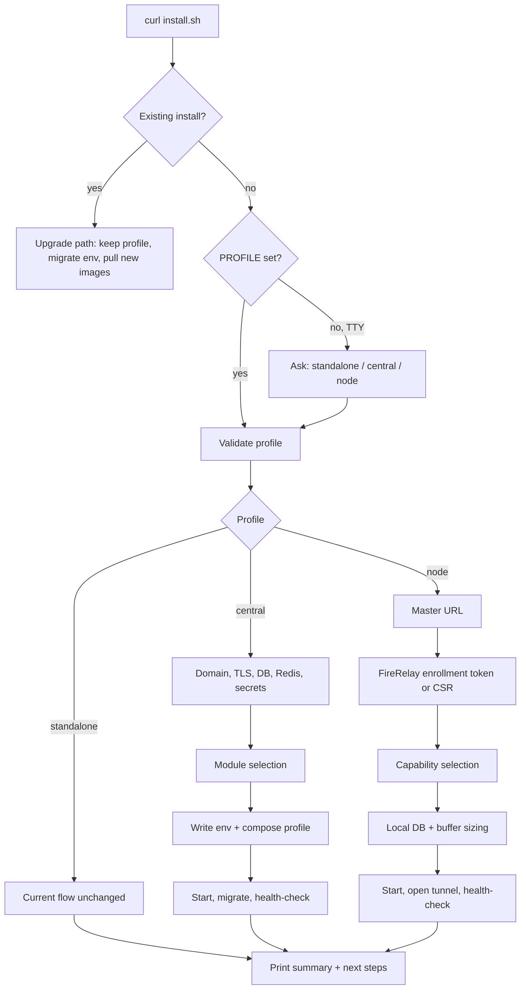

# Installing a modular VigaBSS (complete version)

> Status: Proposed; written 2026-09-07 as a companion to
> [modular-regional-architecture-plan.md](modular-regional-architecture-plan.md).
> A condensed version lives in
> [modular-installation-plan.md](modular-installation-plan.md).
> This document describes the target installation experience, not implemented
> behavior. [ARCHITECTURE.md](../ARCHITECTURE.md) and `install.sh` remain the
> source of truth for the current installer.

## 0. FireRelay is the node system

The regional tier in this plan is FireRelay, not a replacement for it. The
repository already contains the building blocks:

| Exists today | Where | Gap to close |
|---|---|---|
| Node registry with status, load, heartbeat | `firerelay_nodes`, `poller_nodes` | No `organization_id`, no capability list, no assignment generation; two tables for one concept |
| Per-device node assignment | `devices.firerelay_node_id`, `device_polling_configs` | Not enforced by the poller engine |
| Outbound-dialing agent over WebSocket | `src/services/firerelayAgent.js`, `src/scripts/firerelay-agent.js` | Runs only RouterOS handlers; no polling, traps, RADIUS, or provisioning |
| Master-side tunnel and command dispatch | `src/services/firerelayTunnel.js`, `src/routes/firerelay.js` | Single shared `FIRERELAY_TUNNEL_SECRET`, no per-node credential or revocation |
| Node configuration | `FIRERELAY_NODES`, `FIRERELAY_MASTER_URL`, `FIRERELAY_NODE_ID` env | Static env lists; no enrollment API |
| Modes `standalone`, `master`, `worker` | `src/config/firerelay.js` | `worker` means a full second instance; the node profile here is a capability-scoped agent |

Everywhere this document says "regional" or "node", read it as a FireRelay
node enrolled with a FireRelay master. The central profile is the master.

## 1. What changes for the operator

Today `install.sh` installs one thing: the complete stack (MySQL primary and
replica, Redis, app, WireGuard helper, nginx, ChromaDB, certbot) on one host,
configured by environment variables piped into a one-line `curl | bash`.

In the modular design the same one-line entry point stays, but the first
question it asks is **what this host is**. Everything after that follows from
the answer:

| Profile | What the host runs after install | Who installs it |
|---|---|---|
| **Standalone** | The full stack, exactly as today, with every module enabled locally | Small ISPs, evaluations, upgrades from current installs |
| **Central** | Web/API, business modules, scheduler, business workers, regional control API, telemetry ingestion and query | The installation operator, once |
| **FireRelay node** | The extended FireRelay agent with selected capabilities (polling, traps, RADIUS, provisioning, backups, tunnels) plus local MySQL and buffers | The operator or a field engineer, once per region or site |

Design rules the installer must obey:

- **One installer, one image set, one release.** Central and regional hosts
  pull images built from the same tag. Profiles select which containers and
  modules start; they never change the code that was built.
- **Non-interactive by default, interactive when a terminal is present.**
  Every prompt has an environment-variable equivalent, so cloud-init and
  Ansible keep working. This matches the current `DOMAIN=... EMAIL=... bash`
  convention.
- **Modules are declared, not discovered.** The installer writes an explicit
  module list into the host's env file. A missing declaration means the module
  does not run; there is no silent fallback to "everything".
- **Enabling a module grants no permission.** Installation decides capability,
  RBAC decides access. The installer never seeds roles beyond what it does
  today.
- **Fail closed on dependencies.** A central profile without Redis, or a
  regional profile that cannot reach its central control API, stops with a
  clear message instead of degrading to process-local execution.

## 2. The installer flow, step by step



### 2.1 Shared preamble (all profiles)

Unchanged from today: root check, screen/tmux warning, install directory
detection (with the existing `/opt/fireisp` reuse rule), Docker and Compose
installation, and the FireISP-to-VigaBSS upgrade guard.

New in the preamble:

- `PROFILE` variable, prompted when absent and a TTY exists. Default is
  `standalone` so an unattended run with no variables behaves exactly as now.
- A **release manifest** fetched next to the images. It lists the modules in
  this release, their default profile membership, required containers, and
  required env keys. The installer validates selections against the manifest
  rather than hard-coding them in bash.

### 2.2 Standalone

Identical to the current installer. The only visible difference is one extra
line in the generated `.env.prod`:

```
VIGABSS_PROFILE=standalone
VIGABSS_MODULES=all
```

That line is what later lets a standalone install be **split** into central
plus nodes without reinstalling (see section 4).

### 2.3 Central

Order of questions, each with its env-variable name:

1. **Public domain and email** (`DOMAIN`, `EMAIL`). Same as today.
2. **TLS** (`SKIP_TLS`). Same as today.
3. **Database** (`DB_PASSWORD`, `DB_ROOT_PASSWORD`, `MYSQL_REPL_PASSWORD`).
   Same as today. Central always runs the primary/replica pair.
4. **Redis** (`REDIS_PASSWORD`). Required, not optional. The installer refuses
   to write a central profile without it because regional command delivery
   depends on durable queues.
5. **Secrets** (`JWT_SECRET`, `ENCRYPTION_KEY`). Same as today. A new
   `FIRERELAY_CA_KEY` is generated here: the private key of the internal CA that
   signs FireRelay node certificates. It never leaves the master host.
6. **Module selection** (`VIGABSS_MODULES`). Interactive checklist, default
   all business modules on:

   ```
   Business modules to enable on this central host:
     [x] customers       Customers, contracts, services
     [x] billing         Invoicing, payments, CFDI
     [x] support         Tickets, CRM
     [x] inventory       Stock and equipment
     [x] communications  Email, SMS, WhatsApp
     [x] reporting       Reports and AI assistant (adds ChromaDB)
     [x] network-control FireRelay master: node registry, assignments, command authorization
     [x] telemetry       Ingestion, history, rollups (adds ClickHouse)
   ```

   Unchecking `reporting` drops the ChromaDB container. Unchecking
   `telemetry` keeps MySQL-backed history for standalone compatibility and
   skips ClickHouse. `network-control` cannot be unchecked on a central
   profile; without it there is no master for nodes to enroll against.
7. **Node enrollment policy** (`FIRERELAY_ENROLL_MODE`). Either
   `token` (one-time enrollment token per node, created
   later from the FireRelay admin UI) or `csr` (nodes submit a certificate signing request
   that the operator approves in the UI). Default `token`.
8. **WireGuard ports** (`WG_LISTEN_PORT`, `WG_CLIENT_LISTEN_PORT`). Kept on
   central only when the `connectivity` module stays central; when tunnels
   move to nodes these prompts move to the node flow.

The installer then writes `.env.prod`, selects the Compose profile, starts the
stack, runs migrations, and health-checks every enabled module's readiness
endpoint before printing the summary.

```
docker compose -f docker-compose.prod.yml --profile central --env-file .env.prod up -d
```

### 2.4 FireRelay node

A node host has no public web UI, no business database, and no
installation-wide encryption key. Its flow is shorter and centered on
enrollment.

1. **Master URL** (`FIRERELAY_MASTER_URL`, existing variable). For example
   `https://isp.example.com`. The installer probes
   `/api/v1/firerelay/version` to confirm protocol compatibility before
   asking anything else.
2. **Enrollment** (`FIRERELAY_ENROLL_TOKEN` or `FIRERELAY_ENROLL_MODE=csr`).
   This replaces the shared `FIRERELAY_TUNNEL_SECRET` and the static
   `FIRERELAY_NODES` list.
   - Token mode: paste the one-time token generated in the FireRelay admin
     UI. The installer exchanges it for a signed per-node certificate and the
     node identity (node ID, organization scope, region, assignment
     generation).
   - CSR mode: the installer generates a key pair, prints the CSR fingerprint,
     and waits for approval in the central UI, polling until the certificate
     is issued or a timeout expires.
3. **Node identity** is displayed, not typed. The token or approved CSR
   already binds the host to a region; the installer shows the region name and
   organization for confirmation only.
4. **Capability selection** (`VIGABSS_MODULES`). Checklist limited to the
   agent's capabilities, defaults from the node's definition on the master:

   ```
   Capabilities for FireRelay node "north-1":
     [x] polling        SNMP/ICMP polling for assigned devices
     [x] traps          SNMP trap listener (UDP 162)
     [x] radius         FreeRADIUS with local policy snapshot (UDP 1812/1813)
     [x] provisioning   Approved device commands and ACS sessions
     [x] routeros       RouterOS API commands (existing handlers)
     [x] backups        Device configuration backups, staged locally
     [ ] connectivity   WireGuard coordination for NAS and user tunnels
   ```

   Only modules the central definition permits for this region appear
   checked. The installer refuses a selection the central assignment does not
   allow, so a field engineer cannot turn on provisioning for a region that
   central has marked monitoring-only.
5. **Local storage** (`NODE_DB_PASSWORD`, `NODE_BUFFER_GB`). Local
   MySQL password and the reserved buffer size for accounting, command
   journals, and telemetry. The installer computes a suggested size from the
   device count reported by central at 72 hours of measured peak volume, and
   warns if the host's free disk is below it.
6. **Listeners** (`TRAP_PORT`, `RADIUS_AUTH_PORT`, `RADIUS_ACCT_PORT`,
   `WG_LISTEN_PORT`). Only prompted for the modules selected in step 4.

The installer then writes `.env.node`, starts the node Compose profile,
opens the outbound tunnel to the master, and completes enrollment (first
heartbeat, first policy snapshot, first assignment sync), and health-checks each selected service.

```
docker compose -f docker-compose.node.yml --env-file .env.node up -d
```

A regional summary looks like:

```
[✓] FireRelay node north-1 enrolled with https://isp.example.com
[✓] Certificate valid until 2027-09-07 (auto-renews at 30 days)
[✓] Assignment generation 14: 1,832 devices, 3 NAS
[✓] Policy snapshot age: 4s
[✓] Capabilities: polling traps radius provisioning routeros backups
[i] Buffer reserved: 40 GB of 120 GB free
[i] Manage this node at https://isp.example.com/admin/firerelay/nodes/north-1
```

## 3. Files and artifacts the installer produces

| Profile | Env file | Compose entry | Extra state |
|---|---|---|---|
| Standalone | `.env.prod` | `docker-compose.prod.yml` | Same as today |
| Central | `.env.prod` | `docker-compose.prod.yml --profile central` | `region-ca/` (CA key, offline-backup instructions) |
| FireRelay node | `.env.node` | `docker-compose.node.yml` | `node-identity/` (node cert, key, node ID), buffer volume |

Repository additions this implies:

- `docker-compose.node.yml`: the FireRelay agent image, local MySQL,
  FreeRADIUS, optional WireGuard helper. No nginx, no SPA, no ChromaDB.
- FireRelay registry changes: add `organization_id`, `capabilities`,
  `assignment_generation`, and per-node credential columns to
  `firerelay_nodes`; fold `poller_nodes` into it through a compatibility
  view so `src/routes/pollerNodes.js` keeps working.
- FireRelay agent changes: register polling, trap, RADIUS policy sync, and
  provisioning handlers next to the existing RouterOS handlers in
  `src/scripts/firerelay-agent.js`; add local persistence for command
  journals and accounting.
- An enrollment API under `src/routes/firerelay.js` that issues per-node
  certificates and retires `FIRERELAY_TUNNEL_SECRET`.
- Compose **profiles** inside `docker-compose.prod.yml` (`central`, plus
  per-module profiles such as `reporting` and `telemetry`) so unchecked
  modules simply do not start.
- A `release-manifest.json` published with each image tag, consumed by
  `install.sh` for module validation.
- `install.sh` gains `PROFILE`, `VIGABSS_MODULES`, `FIRERELAY_ENROLL_*`,
  and the node prompts; `FIRERELAY_MASTER_URL` keeps its current meaning. The existing variables keep
  their names and meanings.
- The management wrapper (`vigabss` CLI written by the installer) gains
  `vigabss node status`, `vigabss node drain`, and
  `vigabss modules list|enable|disable`.
- Helm charts and `k8s/` gain matching values (`profile`, `modules`,
  `firerelay.enrollToken`) so the Kubernetes path exposes the same choices.

## 4. Upgrades and profile changes

**Upgrading an existing standalone install** runs the current upgrade path
plus one migration that writes `VIGABSS_PROFILE=standalone` and
`VIGABSS_MODULES=all` into `.env.prod`. Nothing else changes. The no-Redis
fallback remains supported for this profile.

**Splitting standalone into central plus nodes** is an explicit,
operator-driven sequence, never automatic:

1. On the existing host, run `vigabss profile convert central`. The command
   validates Redis is present, sets `FIRERELAY_MODE=master`, generates the
   node CA, writes the central
   profile, and restarts. All devices remain in the default local region, so
   polling continues from this host.
2. Install one or more FireRelay nodes with the node flow above.
3. In the FireRelay admin UI, reassign devices and NAS from the default local
   node to the new nodes. Each reassignment drains the old owner and increments
   the assignment generation, as required by the architecture plan.
4. Once the default local region owns nothing, disable network execution
   modules on central with `vigabss modules disable polling traps ...`.

**Rollback** is the reverse: reassign back to the local region, re-enable the
modules on central. A node that is decommissioned is drained first
with `vigabss node drain`, then its certificate is revoked in the UI.

**Version skew.** The installer and the FireRelay agent each report a
synchronization protocol version. Central accepts the current and one prior
version. Upgrading a fleet is master first, then nodes; the installer
refuses to enroll a node whose protocol is newer than the master's.

## 5. Validation the installer performs before declaring success

- Compose file parses with the selected profiles (`docker compose config`).
- Every enabled module answers its readiness endpoint.
- Central: Redis reachable, migrations applied, region CA written and
  backed up to the location the operator confirmed.
- Node: certificate issued, tunnel connected, first heartbeat acknowledged, assignment and
  policy snapshot received, listeners bound on the declared ports, buffer
  volume mounted with the reserved size.
- Node: a **simulated master outage check**. The installer briefly blocks
  the central URL, confirms polling and RADIUS still answer locally, then
  restores connectivity and confirms the backlog drains. This proves the
  72-hour continuity contract on day one rather than during the first real
  outage.
- Standalone: the current post-install checks, unchanged.

## 6. Acceptance for the installer work

- A fresh unattended run with no variables produces a standalone install
  byte-for-byte equivalent in behavior to today's installer.
- `PROFILE=node` with a bad or expired token fails before writing any
  files or starting any container.
- Installing a node profile starts no business worker, no web portal, and
  no listener outside the selected services.
- A node never receives central database credentials, the installation-wide
  encryption key, or a shared tunnel secret; verify by inspecting `.env.node` and the
  container environment.
- Both Compose overlays and the Helm chart pass their existing configuration
  checks in CI for every profile combination in the manifest.
- `docs/deployment.md` and the README document all three profiles, the
  conversion sequence, and the regional summary output. README updates are
  required for implementation.

This is a proposed installation design based on the current `install.sh`,
Compose overlays, and the modular architecture plan. No installer changes have
been implemented or run for this document.
