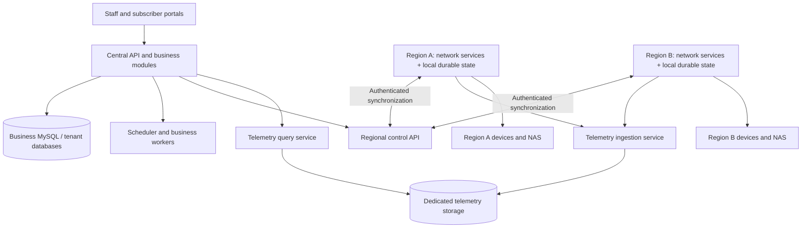

# Modular VigaBSS with autonomous regional network services

> Status: Proposed; saved for future implementation on 2026-09-04.
> This document describes a target architecture, not implemented behavior.
> [ARCHITECTURE.md](../ARCHITECTURE.md) remains the source of truth for the current system.

## 1. Architecture and scope

Keep one central platform for customers, organizations, permissions, billing, and the staff/subscriber portals. Turn network operations into independently deployable services that run near their devices.

Based on the selected requirements, the target is Docker Compose on regional VMs, supporting 5,000–50,000 devices. Regions must continue subscriber authentication, monitoring, and previously approved provisioning during a central outage.

The first release supports three installation profiles:

| Profile | Installed responsibilities |
|---|---|
| Standalone | Existing complete application; Redis remains optional |
| Central | Web/API, business modules, scheduler, business workers, regional control, telemetry ingestion/query |
| Regional | Selected polling, traps, RADIUS, provisioning, backup, and connectivity services; local persistence |

Retain one repository and coordinated releases. Independent deployment and scaling come first; independently versioning every business module is outside this plan.

## 2. Repository and runtime boundaries

The current implementation provides useful building blocks, but needs structural changes:

- [src/server.js](../src/server.js) starts HTTP, scheduling, workers, tunnels, and UDP listeners together.
- [src/services/pollerEngine.js](../src/services/pollerEngine.js) reads the device fleet without enforcing the existing poller-node assignments.
- Queue handlers register together, and some tenant context handling varies between handlers.
- FireRelay is the intended node system and already provides the node registry, outbound agent tunnel, and per-device node assignment. Its current gaps are organization scoping, capability declaration, per-node credentials, an enrollment flow, and an agent that runs only RouterOS commands. The regional tier below extends FireRelay rather than replacing it.

Implement these boundaries:

| Module | Ownership and deployment |
|---|---|
| Platform core | Identity, tenant routing, RBAC, audit, configuration, capability registry; central |
| Business modules | Customers/contracts, billing/payments/CFDI, support/CRM, inventory, communications, reporting/AI; central initially |
| Network control | Desired configuration, regional assignments, command authorization, policy publication; central |
| Network execution | Polling, traps, device adapters, provisioning, backups; regional |
| Subscriber access | RADIUS authentication/accounting and synchronized subscriber policy; regional |
| Connectivity | FireRelay tunnels and WireGuard coordination; regional, retaining the isolated privileged helper |
| Telemetry | Ingestion, history queries, rollups, alert processing; separately scaled central services |

### Implementation rules

- Extend the pnpm workspace with runtime entrypoints and module packages. Extract network functionality first; move other domains incrementally.
- Give each module a manifest declaring dependencies, routes, workers, listeners, configuration, and lifecycle hooks.
- Separate **installed capability**, **process responsibility**, and **user permission**. Enabling a module never grants access.
- Build central and regional images from the same release. Regional images exclude the SPA, billing integrations, and unrelated business dependencies.
- Use the same network executor interfaces locally in standalone mode and remotely in distributed mode.
- Remove import-time startup side effects. Starting an API process must not start polling, scheduled jobs, or UDP listeners.
- Validate dependencies at startup. Distributed deployments require their queue infrastructure; they must not silently fall back to process-local execution.
- Keep existing public REST paths and response shapes where behavior remains synchronous. Represent remote mutations as durable operations with explicit status.

This is deployment modularity backed by enforceable code boundaries, rather than feature flags alone.

## 3. Regional ownership, data, and interfaces

### Ownership and security

Introduce organization-scoped regions and explicit site/device/NAS assignments. Extend the existing FireRelay node registry (folding `poller_nodes` into it through a compatibility mapping) into the general regional-node registry.

- Existing devices enter a default local region during migration.
- Every device has one authoritative execution assignment and an assignment generation.
- Workers receive only their assigned organizations, devices, credentials, and capabilities.
- Regions authenticate through individually revocable certificates over TLS. They receive neither central database credentials nor the installation-wide encryption key.
- Central authorization derives organization and reseller scope from the authenticated user. Machine requests must also match the node’s registered assignment.
- Regional infrastructure administration remains installation-operator controlled. Tenant users see only their permitted operational data.

Keep business writes in the central MySQL/isolated-tenant databases. Regional MySQL stores synchronized policy, command journals, accounting, and outbound data; it does not replicate the complete business schema.

Use versioned application-level synchronization over HTTPS, with outbound regional connections. Do not stretch MySQL transactions or BullMQ connections across regions.

### Contracts

Add versioned internal interfaces for enrollment, heartbeat, assignment/policy synchronization, command delivery, acknowledgements, accounting, and telemetry batches.

Commands carry an operation ID, organization, region, target, assignment generation, expiry, payload version, and idempotency key. Events additionally carry an event ID, source sequence, and observation time.

- Commit command intent and its outbound record in the same central transaction.
- Persist received commands locally before acknowledging delivery.
- Separate delivery acknowledgement from execution success.
- Use at-least-once delivery and durable deduplication. Queue IDs alone are insufficient protection for external side effects; handlers must be retry-safe. [BullMQ guidance](https://docs.bullmq.io/patterns/idempotent-jobs)
- If a device operation times out after it may have succeeded, mark its result unknown and reconcile device state before retrying.
- Keep command ordering per device. Reject expired commands and obsolete assignment generations.
- Reassignment requires draining and acknowledgement from the old owner, or explicit fencing. A missing heartbeat alone cannot authorize a second provisioning owner.

### Offline behavior

Use the agreed **72-hour subscriber-policy window**:

| Workflow | During disconnection |
|---|---|
| Monitoring | Continue assigned polling and local alert evaluation; persist results |
| Subscriber authentication | Use the last valid policy for up to 72 hours; reject unknown subscribers |
| Accounting | Persist locally and synchronize idempotently after reconnection |
| Provisioning | Execute only previously approved, unexpired commands |
| New technician changes | Remain pending centrally until delivery is possible |
| Customer, billing, payment changes | Continue to require the central platform |
| After policy expiry | Reject new authentication; do not forcibly disconnect existing sessions solely because synchronization stopped |

Use regional FreeRADIUS with local SQL policy/accounting, building on the existing integration. Its SQL module supports authorization lookups and accounting storage. [FreeRADIUS SQL reference](https://www.freeradius.org/radiusd/man/rlm_sql.html)

Apply policy snapshots atomically and preserve tenant separation, including overlapping usernames and private device addresses. Central suspensions cannot reach disconnected regions; the 72-hour window explicitly bounds that stale-policy exposure.

Reserve local storage separately for accounting/commands and telemetry. Provision for at least 72 hours at measured peak volume. If telemetry capacity is exhausted, record explicit gaps and shed oldest telemetry; never silently discard accounting or command results.

### Heavy data and user experience

- Extract polling I/O from direct database writes. Batch-load assignments and OID profiles, distribute polling over time, and enforce per-node and per-device concurrency.
- Introduce a telemetry storage interface. Keep MySQL for standalone compatibility; use dedicated ClickHouse storage for the distributed profile.
- Batch regional uploads and acknowledge only after durable acceptance. Preserve stable event IDs and deduplicate before accounting totals, alerts, and rollups.
- Preserve existing metric names, precision behavior, tenant filtering, and history response contracts.
- Store distributed backups in centrally managed object storage with regional staging; avoid dependence on a particular app container’s filesystem.
- Show regional connectivity, policy age, backlog, telemetry freshness, and operation status in the existing UI. Stale observations must not appear as current.
- Use one capability registry for REST/GraphQL availability, navigation, and worker startup. Preserve backend RBAC and add all affected text in English, Spanish, and Portuguese.

## 4. Delivery sequence and rollout

1. **Establish boundaries and a baseline.** Inventory network entrypoints, direct device calls, schedules, SQL dependencies, and listeners. Measure polling/query load. Add module registration and separate API, scheduler, and worker startup while preserving standalone behavior.

2. **Make distributed execution reliable.** Add region/node assignments, machine authentication, durable command/event synchronization, explicit tenant context for every worker, and transactional schedule-occurrence deduplication. Reuse verified FireRelay components without changing existing modes’ meaning.

3. **Ship regional monitoring.** Move polling, traps, and backup collection to regional services. Add local buffering, dedicated telemetry ingestion/storage, compatible history queries, and regional status screens. Pilot one region and verify that the central poller no longer touches its devices.

4. **Ship regional subscriber continuity.** Add local RADIUS policy snapshots, durable accounting, expiry behavior, reconciliation, and tenant-isolated NAS routing. Validate the complete 72-hour outage scenario.

5. **Move authorized device execution and connectivity.** Route provisioning and device mutations through durable commands. Place tunnels, WireGuard coordination, and ACS sessions with their owning region. Maintain an explicit tunnel-owner directory; requests must reach the process that owns the live connection.

6. **Harden installation and expand.** Provide central/regional Compose profiles, enrollment, certificate rotation, drain/reassign commands, per-service health checks, resource limits, backup/restore procedures, and matching Kubernetes/Helm workloads.

Pilot using read-only comparison, then transfer ownership explicitly. Never run two provisioning owners as a comparison test. Rollback means draining the regional owner and restoring the local executor with a new assignment generation.

Use append-only migrations, matching rollbacks, schema parity, and centrally coordinated migration execution. Support one prior synchronization protocol version during upgrades; reject incompatible execution versions.

Update [ARCHITECTURE.md](../ARCHITECTURE.md), README, deployment instructions, and FireRelay documentation alongside each delivered boundary change. README updates are required for implementation.

## 5. Acceptance and validation

### Functional and security acceptance

- Standalone installations retain supported workflows and the no-Redis fallback.
- Installing a regional poller starts no business worker, web portal, or unrelated listener.
- Two workers never both own the same device mutation.
- Cross-organization assignments, forged node identity, stale generations, duplicate events, and revoked credentials fail closed.
- Exercise admin, manager, technician, support, billing, readonly, reseller, and subscriber viewpoints where affected; verify REST/GraphQL permission parity.
- Test central outage, regional restart, queue loss, disk exhaustion, clock skew, duplicate/out-of-order delivery, expired commands, and partial device success.
- Reconnection does not duplicate accounting, provisioning, notifications, or historical rollups.
- Central dashboards clearly distinguish stale regional data from healthy live data.

### Capacity acceptance

Benchmark 5,000, 20,000, and 50,000 simulated devices, including interfaces, slow responses, timeouts, and realistic OID profiles. At 50,000 devices with five-minute polling, the average is approximately 167 device polls/second before interface fan-out; device count alone cannot determine hardware sizing.

On the documented reference hardware:

- At least 99% of polls start within their configured interval.
- Normal-load queues do not grow continuously.
- A 72-hour buffered backlog drains within 24 hours while live traffic continues.
- Core API p95 latency regresses by no more than 10% under equal business load.
- No accepted accounting or command records disappear during crash/replay tests.

### Required completion gates

Run the applicable architecture-matrix gates per phase:

- `pnpm lint`, `pnpm test`, `pnpm run sql:check`, `pnpm run schema:parity`
- `pnpm run migrate:smoke-test`, `pnpm run test:db` against explicitly disposable databases
- `pnpm run openapi`, `pnpm run spec:check`
- Frontend lint/type generation, tests, `i18n:check`, and build
- `pnpm --filter vigabss-e2e test`
- Compose configuration validation, image smoke tests, and affected Helm/deployment checks

Add real multi-process and network-partition tests; mocked database tests cannot demonstrate regional isolation or recovery.

This is a staged architecture plan based on repository inspection. No implementation changes or runtime validation have been performed for this plan.
